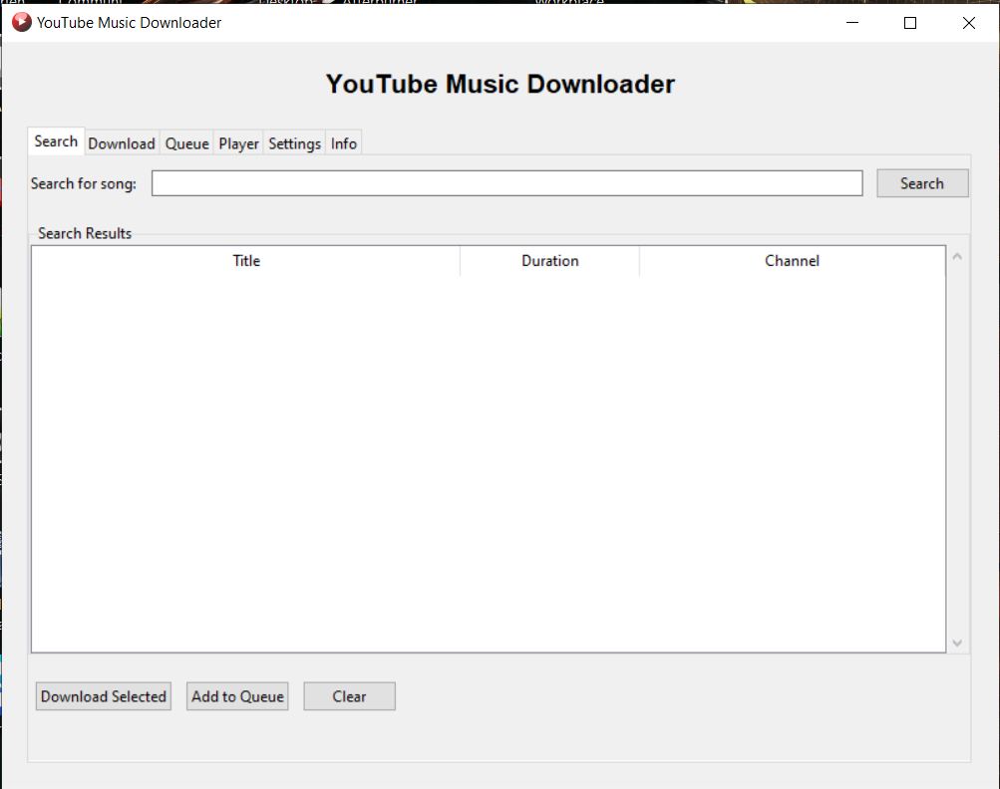

# YouTube Music Downloader

A desktop application that allows you to search, download, and play music from YouTube.

## Features

- Search for songs on YouTube
- Download audio in MP3 or M4A format
- Queue multiple downloads
- Built-in audio player
- Authentication support for age-restricted content

## Installation

### Option 1: Download the Executable

1. Go to the [Releases](https://github.com/Hasintha-Nirmal/youtube-music-downloader/releases) page
2. Download the latest version for your operating system
3. Run the executable

### Option 2: Run from Source

1. Clone the repository